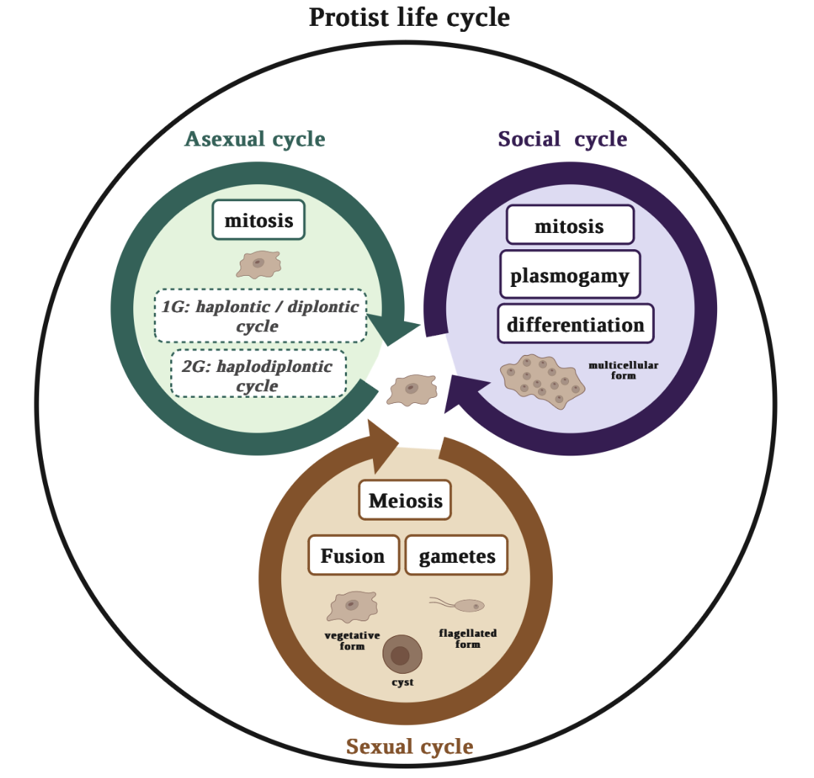
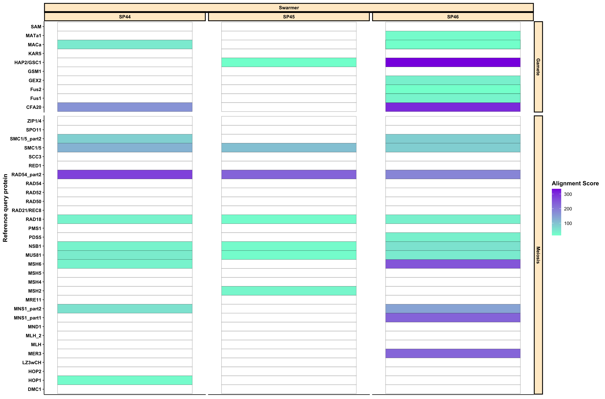

# How to identify sexual cycle cues among uncultivable protists ?


From a genetic point of view, sexual processes seem to have arosen early in the evolution of eukaryotes and be widespread, even though observations of such mechanisms among protists are scarce (Speijer et al. 2015, Goodenough & Heitman 2014). The molecular basis of sexuality is linked to 2 cellular mechanisms: meiotic division (i.e. reduction of cell ploidy) and gamete fusion (i.e. restoration of cell ploidy to pre-meiotic stages) (Speijer et al. 2015, Goodenough & Heitman 2014).

For Rhizaria that are a tedious lineage to cultivate, genetic cues can help understand the reproductive mechanisms involved in their mysterious life cycle. Sexual reproduction has been observed among some cultivable rhizarian lineages (e.g. Phytomyxea and benthic Foraminifera) but remains enigmatic for Radiolaria. The existence of a sexual cycle has long been speculated, notably by Schewiakoff ~100 years ago. Since then, the lifespan, ploidy and role of each radiolarian life stage observed on the field remain to be resolved.

The present github includes the code for identifying reference protist genes specific to gamete and meiotic life stages based on single-cell transcriptomes of Radiolaria.



## Methods

### 1. Target-gene approach

#### 1.1 Functional annotation tools: 
EggNog, Interproscan


#### 1.2 HMM profile search: 
Get size of transcriptome for each lifestage: node_count.sh

````
#!/bin/sh
#
#SBATCH --job-name bash
#SBATCH --cpus-per-task=2
#SBATCH -o o.bash
#SBATCH -e e.bash
#SBATCH --mail-user=iris.rizos@sb-roscoff.fr
#SBATCH --mail-type=BEGIN,FAIL,END

# Get number of predicted genes for each transcriptome
# Swarmer
for f in /shared/projects/rhizaria_ref/Sexual_cycle/meiosis_swarmer/*/*;
do
   nb_node=$(echo | grep -c ">" ${f})
   echo "$nb_node;${f##*/}" >> /shared/projects/swarmer_radiolaria/finalresult/HMM/swarmer/graphics/node_count_MESW.csv
done

# Cyst
for f in /shared/projects/rhizaria_ref/Sexual_cycle/cyst/*;
do
   nb_node=$(echo | grep -c ">" ${f})
   echo "$nb_node;${f##*/}" >> /shared/projects/swarmer_radiolaria/finalresult/HMM/cyst/graphics/node_count_CY.csv
done

# Adult
for f in /shared/projects/rhizaria_ref/Sexual_cycle/adult/*/*;
do
   nb_node=$(echo | grep -c ">" ${f})
   echo "$nb_node;${f##*/}" >> /shared/projects/swarmer_radiolaria/finalresult/HMM/adult/graphics/node_count_VE.csv
done
##
````

Peptidome data

````
#!/bin/sh
#
#SBATCH --job-name hmmsearch
#SBATCH --cpus-per-task=4
#SBATCH -o o.hmmS
#SBATCH -e e.hmmS
#SBATCH --mail-user=iris.rizos@sb-roscoff.fr
#SBATCH --mail-type=BEGIN,FAIL,END

today=$(date +%F)

# Run by life stage
# ${f##*/} allows to remove f extension and keep filename only

for f in /shared/projects/rhizaria_ref/Sexual_cycle/adult/*/*;
do
    hmmsearch -A adult/hmm_gamete_${f##*/}_${today}.sto -o adult/hmm_gamete_${f##*/}_${today}.txt --incdomE 0.001 --domE 0.001 --domtblout adult/hmm_gamete_${f##*/}_${today}.tsv HMM_search_gamete_ref.hmm ${f} 
    hmmsearch -A adult/hmm_meiosis_${f##*/}_${today}.sto -o adult/hmm_meiosis_${f##*/}_${today}.txt --incdomE 0.001 --domE 0.001 --domtblout adult/hmm_meiosis_${f##*/}_${today}.tsv HMM_search_meiosis_ref.hmm ${f} 
done

for f in /shared/projects/rhizaria_ref/Sexual_cycle/meiosis_swarmer/*/*;
do
    hmmsearch -A swarmer/hmm_gamete_${f##*/}_${today}.sto -o swarmer/hmm_gamete_${f##*/}_${today}.txt --incdomE 0.001 --domE 0.001 --domtblout swarmer/hmm_gamete_${f##*/}_${today}.tsv HMM_search_gamete_ref.hmm ${f} 
    hmmsearch -A swarmer/hmm_meiosis_${f##*/}_${today}.sto -o swarmer/hmm_meiosis_${f##*/}_${today}.txt --incdomE 0.001 --domE 0.001 --domtblout swarmer/hmm_meiosis_${f##*/}_${today}.tsv HMM_search_meiosis_ref.hmm ${f} 
done

for f in /shared/projects/rhizaria_ref/Sexual_cycle/cyst/*;
do
    hmmsearch -A adult/hmm_gamete_${f##*/}_${today}.sto -o adult/hmm_gamete_${f##*/}_${today}.txt --incdomE 0.001 --domE 0.001 --domtblout cyst/hmm_gamete_${f##*/}_${today}.tsv HMM_search_gamete_ref.hmm ${f} 
    hmmsearch -A adult/hmm_meiosis_${f##*/}_${today}.sto -o adult/hmm_meiosis_${f##*/}_${today}.txt --incdomE 0.001 --domE 0.001 --domtblout cyst/hmm_meiosis_${f##*/}_${today}.tsv HMM_search_meiosis_ref.hmm ${f} 
done
##

````

Transcripts blasting with query domains were recovered in fasta files.
Headers contain the query id with which the node significantly blasted (eval < 0.001) and the transcriptome id of the alignment.

The following script allows to convert alignements in stockholm format to the fasta file described above.
For that the use of easel miniapps implemented in HMMER is necessary (http://cryptogenomicon.org/extracting-hmmer-results-to-sequence-files-easel-miniapplications.html).

This script is applied to swarmer transcriptome data. The equivalent script is applied to each life stage by changing the working directory.

````
#!/bin/sh
#
#SBATCH --job-name hmm_fasta
#SBATCH --cpus-per-task=2
#SBATCH -o o.hmm
#SBATCH -e e.hmm
#SBATCH --mail-user=iris.rizos@sb-roscoff.fr
#SBATCH --mail-type=BEGIN,FAIL,END

# For every stockholm generated file of significant alignmnets: get target sequences in fasta
for f in /shared/projects/swarmer_radiolaria/finalresult/HMM/swarmer/*.sto;
do
   esl-reformat -o fasta_files/node_${f##*/}.fasta fasta ${f}
done

# Change file extensions
for f in /shared/projects/swarmer_radiolaria/finalresult/HMM/swarmer/fasta_files/*.sto.fasta;
do 
   cd /shared/projects/swarmer_radiolaria/finalresult/HMM/swarmer/fasta_files/
   mv "$f" "$(basename "$f" .sto.fasta).txt.fasta"
done

# Add query id to each target sequence significantly aligned (to its query)
cd /shared/projects/swarmer_radiolaria/finalresult/HMM/swarmer/
for f in /shared/projects/swarmer_radiolaria/finalresult/HMM/swarmer/*.tsv;
do
# Parse tsv to get node and query id
   sed 's/  */ /g' ${f} | awk -F " " '/^N/ {print$1";"$4}' > node_${f##*/}.txt
done

# Change file extensions
for f in /shared/projects/swarmer_radiolaria/finalresult/HMM/swarmer/*.tsv.txt;
do 
   mv "$f" "$(basename "$f" .tsv.txt).txt"
done

# Print query in front of corresponding node id of fasta file
for f in /shared/projects/swarmer_radiolaria/finalresult/HMM/swarmer/node_*.txt;
do
   echo "looping 1 "${f##*/}""
   for i in $(cat ${f});
   do
      echo "im in the loop 2"
      node=$(echo $i | cut -d';' -f1)
      echo "$node"
      query=$(echo $i | cut -d';' -f2)
      echo "$query"
      cd /shared/projects/swarmer_radiolaria/finalresult/HMM/swarmer/fasta_files/
      awk -v var1="$node" -v var2="$query" '/^>/ {print ">"var1"/"var2"/"$0} ; !/^>/ {print $0}' ${f##*/}.fasta | awk -F "/" '/^>/ {if ($1==$3) {print ">"$2"/"$3}} ; !/^>/ {print $0}' >> query_${f##*/}.fasta
   done
done

# Add transcriptome id in header of each sequence
for f in /shared/projects/swarmer_radiolaria/finalresult/HMM/swarmer/fasta_files/query_*.txt.fasta;
do
   id_name=$(echo "${f##*/}")
   echo "$id_name"
   awk -v name="$id_name" '/^>/ {print$0"/"name} ; !/^>/ {print$0}' ${f} | sed 's/\/>/\//g' | sed 's/.txt.fasta//g' > final_${f##*/}
done
##
````

After the fasta sequences have been gathered, they are reorganised by query protein id. Transcripts from different transcriptomes and life stages are grouped together based on the meiosis and gamete query ids with the following script:

````
#!/bin/sh
#
#SBATCH --job-name fasta_by_id
#SBATCH --cpus-per-task=2
#SBATCH -o o.fasta
#SBATCH -e e.fasta
#SBATCH --mail-user=iris.rizos@sb-roscoff.fr
#SBATCH --mail-type=BEGIN,FAIL,END

# Create separate folders for storing transcripts by hmm query
for f in /shared/projects/swarmer_radiolaria/finalresult/HMM/swarmer/fasta_files/final*.fasta;
do
   echo "looping 1 "${f##*/}""
   for i in $(cat gamete_query_ids.txt);
    do
      echo "im in the loop 2"
      query=$(echo $i | cut -f1)
      echo "$query"
      tr -d "\n" < ${f} | sed 's/-06/-06\//g' | sed 's/>/\n>/g' | awk -v var1="$query" '/^>/ {print ">"var1"/"$0}' | awk -F "/" '{if ($1==$2) {print $2"/"$3"/"$4"\n"$5}}' >> gamete_folder_id/${query}.fasta
   done
done
##
````

These output files are the basis of multiple sequence alignemnts and phylogenetic gene trees reconstructions (cf. 2.2).


#### 1.3 Blast identified gene reads on reference protist genes: 
Transcriptome data


### 2. Comparative approach

#### 2.1 Creating clusters of ortholog genes:
Orthofinder


#### 2.2 Phylogenetic relationships of sexual genes:
Are the gene trees and species tree congruent ?


## Reference protist genes

Gamete related = 10 (cf. table X)
CFA20, macA, HAP2-GCS1, Fus1, GEX2, KAR5, Fus2, MATa1, SAM, MatA

among which 10 gamete specific = all except CFA20

Meiosis related = 33
among which X meiosis specific =


## Life stages

The radiolarian life stages studied here are:

-Swarmer: hypothetical gamete stage 
The expression of gamete reference genes is investigated among 4 single-cell swarmer transcriptomes of 3 acantharian and 1 collodarian species.

-Meiosis: stage before swarmer release, morphologically identifiable by a change of color, size, shape and granulosity of the cell 

Two types of meiosis stages are supposed to apply to Radiolaria according to the modality of swarmer release:

*Vegetative swarming*: the overall shape of the cell remains the same while swarmers emerge from the cytoplasm

Samples include 1 acantharian, 1 spumellarian and 1 foraminiferan species.

*Cyst swarming*: the cell forms a dense and opaque round-shaped structure from which swarmer emerge either through a pore or the periphery of the cyst

Samples include 2 acantharian species among which one also undergone vegetative swarming (i.e. one of the acantharian swarmer samples).

Both the expression of meiosis and gamete reference genes is investigated as the presence of swarmers inside the cell is suspected.


## Scripts

### 1. Functional annotation tools: 
bash eggnog + interpro

scRNA_FuAnnotations.Rmd

### 2. HMM profile search: 

* Analysis:

HMM_search.sh

hmm_fasta_convert_{lifestage}.sh

fasta_folders.sh

* Graphical outputs:
hmm_graphics_1.sh

Get eval for each alignment.

````
#!/bin/sh
#
#SBATCH --job-name bash
#SBATCH --cpus-per-task=2
#SBATCH -o o.bash
#SBATCH -e e.bash
#SBATCH --mail-user=iris.rizos@sb-roscoff.fr
#SBATCH --mail-type=BEGIN,FAIL,END

# Add query id to each target sequence significantly aligned (to its query) and alignement score
cd /shared/projects/swarmer_radiolaria/finalresult/HMM/swarmer/
for f in /shared/projects/swarmer_radiolaria/finalresult/HMM/swarmer/*.tsv;
do
   id_name=$(echo "${f##*/}")
   echo "$id_name"
   refpr=$(echo $id_name | cut -d'_' -f2)
   echo "$refpr"
   sed 's/  */ /g' ${f} | awk -v name="$id_name" -v ref="$refpr" -F " " '/^N/ {print$1";"$4";"$27";"name";swarmer;"ref}' | sed 's/(+),score=//g' | sed 's/(-),score=//g' | uniq >> graphics/node_query_score.csv
done

cd /shared/projects/swarmer_radiolaria/finalresult/HMM/swarmer/graphics/
awk -F";" '$4 ~/soft/ || $4 ~/S/ {print$0";S"} ; $4 !~/soft/ && $4 !~/S/ && $4 !~/hf/ && $4 !~/H/ && $4 !~/hard/ {print$0";T"} ; $4 ~/hard/ || $4 ~/H/ || $4 ~/hf/ {print$0";H"}' node_query_score.csv > node_query_score_2.csv
awk -F";" '$4 ~/hf44/ {print$0";A1_Vi_SW"} ; $4 ~/hf45/ {print$0";A2_Vi_SW"} ; $4 ~/hf46/ {print$0";A3_Vi_SW"} ; $4 ~/E561/ {print$0";A4_Vi_CY"} ; $4 ~/E587/ {print$0";A2_Vi_CY"} ; $4 ~/M345/ {print$0";F1_Mo_MESW"}  ; $4 ~/M357/ {print$0";C1_Mo_SW"} ; $4 ~/M380/ {print$0";A5_Mo_ME"} ; $4 ~/SP22/ {print$0";A5_Vi_ME"}' node_query_score_2.csv > node_query_score_3.csv
awk -F";" '{OFS = FS} $8 ~/ME/ {$5="meiosis"} ; {print$0}' node_query_score_3.csv > node_query_score_4.csv
##
````

hmm_graphics_2.sh

Get eval, accuracy, number of hits per query, query coverage, total nb of nodes in transcriptomes

````
#!/bin/sh
#
#SBATCH --job-name bash
#SBATCH --cpus-per-task=2
#SBATCH -o o.bash2
#SBATCH -e e.bash2
#SBATCH --mail-user=iris.rizos@sb-roscoff.fr
#SBATCH --mail-type=BEGIN,FAIL,END

# Gather additional data of HMM output:
# Add query id to each target sequence significantly aligned (to its query) and alignement score
for f in /shared/projects/swarmer_radiolaria/finalresult/HMM/swarmer/*.tsv;
do
   id_name=$(echo "${f##*/}")
   echo "$id_name"
   refpr=$(echo $id_name | cut -d'_' -f2)
   echo "$refpr"
   sed 's/  */ /g' ${f} | awk -v name="$id_name" -v ref="$refpr" -F " " '/^N/ {print$1";"$4";"$7";"$8";"$22";"name";swarmer;"($17-$16+1)/$6";"ref}' | sed 's/(+),score=//g' | sed 's/(-),score=//g' | uniq >> node_query_score.csv
done

awk -F";" '$6 ~/soft/ || $6 ~/S/ {print$0";S"} ; $6 !~/soft/ && $6 !~/S/ && $6 !~/hf/ && $6 !~/H/ && $6 !~/hard/ {print$0";T"} ; $6 ~/hard/ || $6 ~/H/ || $6 ~/hf/ {print$0";H"}' node_query_score.csv > node_query_score_2.csv
awk -F";" '$6 ~/hf44/ {print$0";A1_Vi_SW"} ; $6 ~/hf45/ {print$0";A2_Vi_SW"} ; $6 ~/hf46/ {print$0";A3_Vi_SW"} ; $6 ~/E561/ {print$0";A4_Vi_CY"} ; $6 ~/E587/ {print$0";A2_Vi_CY"} ; $6 ~/M345/ {print$0";F1_Mo_MESW"}  ; $6 ~/M357/ {print$0";C1_Mo_SW"} ; $6 ~/M380/ {print$0";A5_Mo_ME"} ; $6 ~/SP22/ {print$0";A5_Vi_ME"}' node_query_score_2.csv > node_query_score_3.csv
awk -F";" '{OFS = FS} $11 ~/ME/ {$9="meiosis"} ; {print$0}' node_query_score_3.csv > node_query_score_4.csv

   # Count number of hits per reference, meiosis
for f in /shared/projects/swarmer_radiolaria/finalresult/HMM/swarmer/*.tsv;
do
cd /shared/projects/swarmer_radiolaria/finalresult/HMM/swarmer/fasta_files/
echo "looping 1 "${f##*/}""
   for i in $(cat meiosis_query_ids.txt);
    do
      echo "im in the loop 2, $i"
      hits=$(echo | grep -c "$i" ${f})
      echo "$i;${f##*/};$hits" >> ../graphics/meiosis_query_counts.csv
   done
      # Count number of hits per reference, gamete
   echo "looping 1 "${f##*/}""
   for i in $(cat gamete_query_ids.txt);
    do
      echo "im in the loop 2, $i"
      hits=$(echo | grep -c "$i" ${f})
      echo "$i;${f##*/};$hits" >> ../graphics/gamete_query_counts.csv
   done
done

cd /shared/projects/swarmer_radiolaria/finalresult/HMM/swarmer/graphics/
grep -F -v ";0" meiosis_query_counts.csv > meiosis_query_counts2.csv && mv meiosis_query_counts2.csv meiosis_query_counts.csv 
grep -F -v ";0" gamete_query_counts.csv > gamete_query_counts2.csv && mv gamete_query_counts2.csv gamete_query_counts.csv 

for i in $(cat gamete_query_counts.csv);
do
  echo "$i"
  target=$(echo "$i" | cut -d';' -f2)
  hits=$(echo "$i" | cut -d';' -f3)
  pr=$(echo "$i" | cut -d';' -f1)
  echo "$target;$hits;$pr"
  awk -v tar="$target" -v hit="$hits" -v prot="$pr" -F";" '$6==tar && $2==prot {print$0";"hit}' node_query_score_4.csv >> node_query_score_hits.csv
done

for i in $(cat meiosis_query_counts.csv);
do
  echo "$i"
  target=$(echo "$i" | cut -d';' -f2)
  hits=$(echo "$i" | cut -d';' -f3)
  pr=$(echo "$i" | cut -d';' -f1)
  echo "$target;$hits;$pr"
  awk -v tar="$target" -v hit="$hits" -v prot="$pr" -F";" '$6==tar && $2==prot {print$0";"hit}' node_query_score_4.csv >> node_query_score_hits.csv
done

# Add nb of nodes in each transcriptome
for i in $(cat node_count_MESW.csv);
do 
  echo "$i"
  count=$(echo "$i" | cut -d';' -f1)
  target=$(echo "$i" | cut -d';' -f2)
  echo "$target;$count"
  awk -v targ="$target" -v nb="$count" -F";" '$6~$targ {print$0";"nb}' node_query_score_hits.csv >> node_count_query_score_hits.csv
done
##
````

scRNA_HMM.Rmd



### 3. Blast identified gene reads on reference protist genes: 


### 4. Orthofinder: 


### 5. Phylogenetic reconstructions: 

#### Species Tree
Recovery of rRNA sequences in transcriptomes:
````
#!/bin/sh
#
#SBATCH --job-name rrna_recovery
#SBATCH --cpus-per-task=2
#SBATCH -o o.rrna
#SBATCH -e e.rrna
#SBATCH --mail-user=iris.rizos@sb-roscoff.fr
#SBATCH --mail-type=BEGIN,FAIL,END

# For every eukaryotic fasta file
for f in /shared/projects/swarmer_radiolaria/finalresult/rrna/*euk*.fasta;
do
   echo "looping 1 "${f##*/}""
   id=${f##*/}
   sed "s/)/)$id/g" ${f} | tr -d "\n" | sed 's/>/\n>/g' | grep "18S_rRNA" | sed 's/.fasta/\n/g' >> 18S_rRNA.fasta
   sed "s/)/)$id/g" ${f} | tr -d "\n" | sed 's/>/\n>/g' | grep "28S_rRNA" | sed 's/.fasta/\n/g' >> 28S_rRNA.fasta
   sed "s/)/)$id/g" ${f} | tr -d "\n" | sed 's/>/\n>/g' | grep "5_8S_rRNA" | sed 's/.fasta/\n/g' >> 5_8S_rRNA.fasta
   sed "s/)/)$id/g" ${f} | tr -d "\n" | sed 's/>/\n>/g' | grep "5S_rRNA" | sed 's/.fasta/\n/g' >> 5_8S_rRNA.fasta
done
##

````

#### Genes Tree

## Next steps

Building a phylogenetic tree of identified genes and validating radiolarian specific marker genes of the sexual cycle (SexCy markers). 
