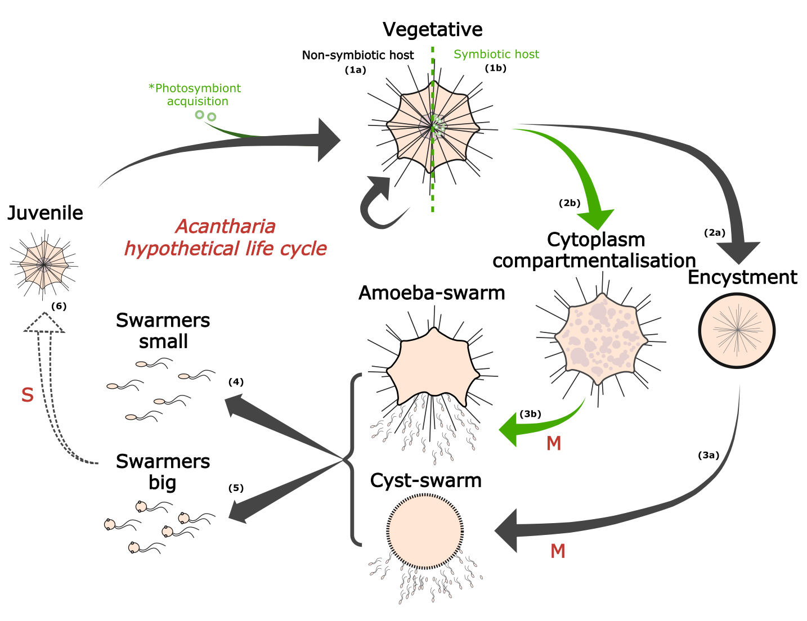
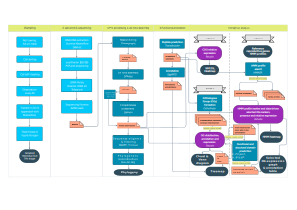

# How to identify sexual cycle cues of uncultivated protists ?

From a genetic point of view, sexual processes seem to have arosen early in the evolution of eukaryotes and be widespread, even though observations of such mechanisms among protists are scarce (Speijer et al. 2015, Goodenough & Heitman 2014). The molecular basis of sexuality is linked to 2 cellular mechanisms: meiotic division (i.e. reduction of cell ploidy) and gamete fusion (i.e. restoration of cell ploidy to pre-meiotic stages) (Speijer et al. 2015, Goodenough & Heitman 2014).

For Rhizaria that are a tedious lineage to cultivate, genetic cues can help understand the reproductive mechanisms involved in their mysterious life cycle. Sexual reproduction has been observed among some cultivable rhizarian lineages (e.g. Phytomyxea and benthic Foraminifera) but remains enigmatic for Radiolaria. The existence of a sexual cycle has long been speculated, notably by Schewiakoff ~100 years ago. Since then, the lifespan, ploidy and role of each radiolarian life stage observed on the field remain to be resolved.

The present github includes the code for identifying reference protist genes specific to gamete and meiotic life stages and novel life stage specific protein families in single-cell transcriptomes of Radiolaria.

## Trascriptomic analyses reveal sexual cues in reproductive life stages of uncultivated Acantharia (Radiolaria)

This code is associated to the publication of Rizos et al., 2025 in Protist (10.1016/j.protis.2025.126102).

### Abstract

The ability to reproduce is a key process for the perpetuation of organisms. Along the evolution of protist reproductive strategies, the molecular machinery of sexual recombination is estimated to have been inherited from the last eukaryotic common ancestor (LECA). Unraveling the sexual cycles of free-living protists remains challenging, given the enigmatic roles of many uncultivated life stages. For the planktonic group of Acantharia (Radiolaria), a hypothetical sexual cycle has been proposed since the late 19th century, including a gamete-like stage, referred to as swarmers. In order to investigate the sexual nature of acantharian reproductive stages, we compared transcriptomes of various acantharian life stages. Our results show distinct functional profiles for reproductive and vegetative stages, while revealing the expression of the gamete fusion genes, HAP2/GCS1 and KAR5-GEX1-BMB in swarmers. Annotation of differentially expressed life stage-specific genes, also highlighted putative meiosis-related functions among pre-swarmer and swarmer stages, while suggesting the existence of a putative zygotic stage. This original life stage-specific genetic data is coherent with morphological evidence supporting the acantharian sexual cycle, with swarmers acting as gametes. Moreover, it paves the way for a deeper understanding of radiolarian cell biology and ecology at a single-cell scale.

# Method

A two-step approach was employed for describing the functional profiles of each life stage and determine their implication in a sexual cycle. First, reference sexual eukaryote genes were targeted (1) and, second, as a means to deal with the load of poorly annotated genes of uncultivated protists (~2/3), all single-cell transcriptomes were cross-compared (2) in order to highlight novel life stage specific gene families.

## Data

The radiolarian life stages studied here are:

* Vegetative: stage at which the cell feeds and arrives at maturity for reproduction
The vegetative Acantharian cells studied are used as references (negative control) compared to sexual cycle life stages and include 2 non-symbiotic vegetative cells and 2 photosymbiotic vegetative cells

* Swarmer: hypothetical gamete stage 
The expression of gamete reference genes is investigated among 3 single-cell swarmer transcriptomes of 3 Acantharia. One foraminiferan swarmer transcriptome is included as sexual cycle reference (positive control).

* Meiosis: stage before swarmer release, morphologically identifiable by a change of color, size, shape of the cell and cytoplasm texture 

Two types of meiosis stages are supposed to apply to Radiolaria according to the modality of swarmer release:

*Vegetative swarming*: the overall shape of the cell remains the same while swarmers emerge from the cytoplasm

Samples include 1 acantharian and 1 foraminiferan species.

*Cyst swarming*: the cell forms a dense and opaque round-shaped structure from which swarmer emerge either through a pore or the periphery of the cyst

Samples include 2 acantharian species among which one also undergone vegetative swarming (i.e. one of the acantharian swarmer samples).

Both the expression of meiosis and gamete reference genes is investigated as the presence of swarmers inside the cell is suspected.

## 1. Background analysis

### 1.1 Functional annotation & differential expression: 

Tools: EggNOG (http://eggnog6.embl.de/#/app/results?seqid=Q5D892&target_nogs=KOG0952), Salmon (https://salmon.readthedocs.io/en/latest/salmon.html), Kallisto (https://pachterlab.github.io/kallisto/about.html)

*the tools were run on command line, versions are noted in corresponding scripts*

* Input: EggNOG - predicted protein sequences (.pep file), Salmon/Kallisto - ?
* Output: annotations.tsv, abundance.tsv

### 1.2 Multivariate analysis: 

Tools: R

* Input: annotations.tsv, abundance.tsv
* Output: NMDS, heatmap

### 1.3 Phylogenetic placement of single-cells: 

Tools: Barrnap, R, MAFFT, Trimal, RaxML-ng

* Input: transcripts.fasta, annotations.tsv, abundance.tsv
* Output: barcode copies relative expression, maximum likelihood phylogeny

## 2. Target-gene approach

### Reference protist genes

Gamete related genes= 11 (cf. table X)
CFA20, MAC-A, HAP2-GCS1, FUS1, GEX2, KAR5, Fus2, MATa1, SAM, MatA, CFA20

among which 10 gamete specific = all except CFA20

Meiosis related = 32 (cf. table X)
among which 11 meiosis specific = REC8, HOP1, SPO22, PCH2, SPO11, HOP2, MND1, DMC1, MSH4, MSH5, MER3

### 2.2 HMM profile search: 

The HMM profiles were downloaded from: http://pfam.xfam.org 

Tools: HMMER, R

* Input: peptides.fasta, annotations.tsv, abundance.tsv
* Output: heatmap of significantly aligned HMM profiles and expression

### 2.3 Creation of lineage specific HMM profiles: 

Seed sequences of the meiosis and gamete specific genes were downloaded for the lineages: Alveolata, Archaeplastida, Stramemopiles from https://www.ebi.ac.uk/interpro/search/sequence/ 
HMM profiles were created for each lineage and a manual significance threshold was calculated with a homemade R script.

The supplementary hits recovered were added in the gloabl HMM profile graphical representation.

Tools: HMMER, R

* Input: peptides.fasta, abundance.tsv
* Output: heatmap of significantly aligned HMM profiles and expression

## 3. Comparative approach

### 3.1 Create clusters of orthologous proteins:

Tools: OrthoFinder, https://github.com/davidemms/OrthoFinder

* Input data: all life stage single-cell trancriptomes
* Output data: orthofinder folders (check manual on git page above)

### 3.2 Identify life stage specific protein families:

Tools: bash, R

* Input data: 
* Output data: visualisation of OG distribution among life stages with venn diagram, chord diagram 

### 3.3 Select most up/down-regulated protein families for each life stage:

Tools: R

* Input data: TPM_abund.tsv, 
* Output data: barplot of gene expression + list of OG enriched by life stage

### 3.4 Annotation of most up/down-regulated protein families for each life stage:

Tools: blastp, InterPro, MyCLADE, Phyre2

* Input data: protein sequences of each protein family
* Output data: table of annotations

## Summary flowchart

## Tool versions

### 1. Background analysis

-Command-line tools:

spades/3.15.5
fastp/0.23.1 
prinseq/0.20.4
barrnap/0.9
trinity/2.13.2
eggnog-mapper/2.1.11
mafft/7.515
trimal/1.4.1
raxml-ng/1.1.0

-R studio:

### 2. Target-gene approach

-Command-line tools:

hmmer/3.2.1
mafft/7.515

### 3. Comparative approach

-Command-line tools:

orthofinder/2.5.2

-R studio:

-Online annotation tools:

# How to navigate this git ?

Each step followed in the section *Method* has an equivalent folder in which the input/output data and scripts are available! In case the input data is the output data of the previous step, files are uploaded once, in the folder corresponding to the step they were generated. The list of steps and flowchart above will guide you to the right folder.

# Perspectives

It seems like Acantharia are capable of sexual reproduction, what if other uncultivated protists too? 

Feel free to apply and re-adapt the method provided here to your own uncultivated life stages! 

