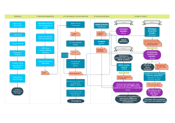

# How to identify sexual cycle cues of uncultivated protists ?

From a genetic point of view, sexual processes seem to have arosen early in the evolution of eukaryotes and be widespread, even though observations of such mechanisms among protists are scarce (Speijer et al. 2015, Goodenough & Heitman 2014). The molecular basis of sexuality is linked to 2 cellular mechanisms: meiotic division (i.e. reduction of cell ploidy) and gamete fusion (i.e. restoration of cell ploidy to pre-meiotic stages) (Speijer et al. 2015, Goodenough & Heitman 2014).

For Rhizaria that are a tedious lineage to cultivate, genetic cues can help understand the reproductive mechanisms involved in their mysterious life cycle. Sexual reproduction has been observed among some cultivable rhizarian lineages (e.g. Phytomyxea and benthic Foraminifera) but remains enigmatic for Radiolaria. The existence of a sexual cycle has long been speculated, notably by Schewiakoff ~100 years ago. Since then, the lifespan, ploidy and role of each radiolarian life stage observed on the field remain to be resolved.

The present github includes the code for identifying reference protist genes specific to gamete and meiotic life stages and novel life stage specific protein families in single-cell transcriptomes of Radiolaria.

## Genetic insight into the sexual cycle of Acantharia (Radiolaria)

This code is associated to the publication of (authors) in (journal).

### Abstract

As an innate property of life, the ability to self-reproduce is a key process for the perpetuation of all micro-organisms. Along the evolution of protist reproductive strategies, the molecular machinery of sexual reproduction is estimated to have been inherited from the last eukaryotic common ancestor (LECA). Nevertheless, among extant protist lineages, describing novel sexual cycles is laborious as the role of uncultivated life stages remains enigmatic. For the uncultivated planktonic group of Radiolaria, a hypothetical sexual cycle has been proposed since the late 19th century. Detailed observations and descriptions of Acantharia radiolarians, made by Schewiakoff and Haeckel, have converged to the description of a life cycle including the formation of a gamete-like life stage of unknown ploidy, called swarmers, that is produced either via the vegetative cell or a cyst. In order to elucidate the function of these uncultivated life stages, we have explored molecular signs of sexual reproduction in single-cell transcriptomics of multiple acantharian life stages. Overall, our data illustrates distinct functional profiles for reproductive and vegetative life stages, while highlighting reference eukaryotic genes involved in gamete fusion, like HAP2/GCS1 and GEX1-KAR5, and life stage specific orthologous protein groups (OGs). Differential expression analysis indicated 7 up-regulated OGs specific of swarmers and 1 up-regulated OG common between both swarmer and cyst life stages. The identified genes of interest feature the potential for developing life cycle markers for estimating the acantharian lifespan in the ocean. Approaching the acantharian reproductive cycle from a genetic point of view, allows a better comprehension of the cell biology and ecology of Radiolaria at a single-cell scale. 

*Link to publication:*

# Method

A two-step approach was employed for describing the functional profiles of each life stage and determine their implication in a sexual cycle. First, reference sexual eukaryote genes were targeted (1) and, second, as a means to deal with the load of poorly annotated genes of uncultivated protists (~2/3), all single-cell transcriptomes were cross-compared (2) in order to highlight novel life stage specific gene families.

## Data

The radiolarian life stages studied here are:

-Swarmer: hypothetical gamete stage 
The expression of gamete reference genes is investigated among 4 single-cell swarmer transcriptomes of 3 acantharian and 1 collodarian species.

-Meiosis: stage before swarmer release, morphologically identifiable by a change of color, size, shape and granulosity of the cell 

Two types of meiosis stages are supposed to apply to Radiolaria according to the modality of swarmer release:

*Vegetative swarming*: the overall shape of the cell remains the same while swarmers emerge from the cytoplasm

Samples include 1 acantharian, 1 spumellarian and 1 foraminiferan species.

*Cyst swarming*: the cell forms a dense and opaque round-shaped structure from which swarmer emerge either through a pore or the periphery of the cyst

Samples include 2 acantharian species among which one also undergone vegetative swarming (i.e. one of the acantharian swarmer samples).

Both the expression of meiosis and gamete reference genes is investigated as the presence of swarmers inside the cell is suspected.

## Preliminary analysis

### 1.1 Functional annotation & differential expression: 

Tools: EggNog, Salmon, Kallisto

* Input: predicted protein sequences (.pep file)
* Output: annotations.tsv, abundance.tsv

### 1.2 Multivariate analysis: 

Tools: R

* Input: annotations.tsv, abundance.tsv
* Output: NMDS, heatmap

### 1.3 Phylogenetic placement of single-cells: 

## 1. Target-gene approach

### Reference protist genes

Gamete related genes= 11 (cf. table X)
CFA20, MAC-A, HAP2-GCS1, FUS1, GEX2, KAR5, Fus2, MATa1, SAM, MatA, CFA20

among which 10 gamete specific = all except CFA20

Meiosis related = 32 (cf. table X)
among which 11 meiosis specific = REC8, HOP1, SPO22, PCH2, SPO11, HOP2, MND1, DMC1, MSH4, MSH5, MER3

### 1.2 HMM profile search: 

The HMM profiles were downloaded from: 

### 1.3 Creation of lineage specific HMM profiles: 

### 1.4 Identification of up-regulated reference meiosis and syngamy related genes:

fig

## 2. Comparative approach

### 2.1 Create clusters of orthologous proteins:

Tools: OrthoFinder, https://github.com/davidemms/OrthoFinder

*Input data: all life stage single-cell trancriptomes
*Output data: orthofinder folders (check manual on git page above)

Scripts: 

### 2.2 Identify life stage specific protein families:

Tools: bash, R

*Input data: 
*Output data: visualisation of OG distribution among life stages with venn diagram, chord diagram 

Scripts:

### 2.3 Select most up/down-regulated protein families for each life stage:

Tools: R

*Input data: TPM_abund.tsv, 
*Output data: barplot of gene expression + list of OG enriched by life stage

Scripts:

### 2.4 Annotation of most up/down-regulated protein families for each life stage:

Tools: blastp, InterPro, MyCLADE, Phyre2

*Input data: protein sequences of each protein family
*Output data: table of annotations

Scripts: manual search

## Summary flowchart

# How to navigate this git ?

# Perspectives

